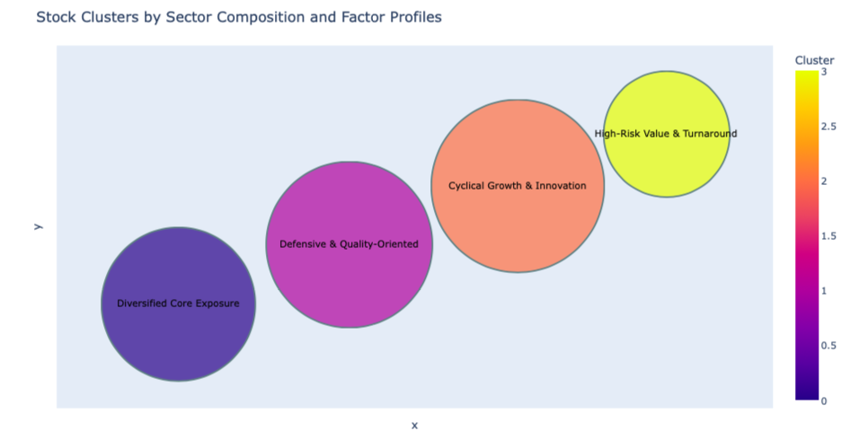

This project applies financial econometrics and machine learning to analyze and segment S&P 500 stocks. Using historical price data and the Fama-French 5-Factor model, it estimates each stock's exposure to key systematic risk factors (market, size, value, profitability, and investment). These factor loadings are then used as input to a K-Means clustering algorithm to identify groups of stocks with similar risk-return characteristics.

The notebook includes:

Web scraping of S&P 500 constituents

Historical price and return computation

Regression of excess returns on Fama-French factors

K-Means clustering based on estimated betas

Visualization of cluster profiles by sector and factor exposure

The goal is to demonstrate how systematic risk factors can be used to uncover meaningful structure in equity markets, with potential applications in asset allocation, factor investing, and risk analysis.
